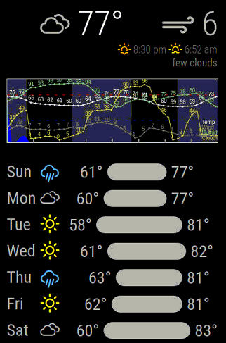

# MMM-WeatherGraph

This an extension for [MagicMirror](https://github.com/MichMich/MagicMirror) that displays current and forecasted weather.

This module started as a fork of 'MMM-forecast.io' by dmcinnes (https://github.com/dmcinnes/MMM-forecast-io), adding many new features and moving to a new data source since DarkSky discontinued API access. (Thanks Apple- so nice of you.)

Features:

-Current weather, including temp and wind

-Sunrise / sunset time

-7 day forecase with visual for temp ranges

-2 day precipation graph, with temp, wind, humidity, and cloudcover

-Lots of options to turn on/off any parts you want

-Impetial/metric and 12/24 hour time options

## Installation:

-Get an API key from OpenWeatherMap.org.  https://openweathermap.org/darksky-openweather

-Open a terminal window on your device

-Navigate to your MagicMirror's modules folder. If you are using the default installation directory, use the command:

cd ~/MagicMirror/modules

-Copy the module to your computer by executing the following command:

git clone https://github.com/FlatPepsi17/MMM-WeatherGraph

-If you're using a MagicMirror, you need to lookup your GPS coordinates.  One way is to find your location is to open maps.google.com, and right-click on your location.  Use these coordinates in the config file to ensure you get weather for your location.

-This module uses white icons by default.  If you prefer color coded icons, merge the contents of the "Color-icons.md" file into your "css\custom.css" file. 

Example screen shots:
Rain is the filled blue graph, snow is the filled white graph


Turn off features to make a simple display.


Want to see everything? Here's temp, wind, humidity, and cloud cover. Legend in the bottom right corner.



Metric is supported, and the precipation graph can be adjusted. THis one shows 24 hours.


## Using the module

To use this module, add it to the modules array in the `config/config.js` file. Minimal setup:
````javascript
modules: [
  {
    module: 'MMM-WeatherGraph',
    position: 'top_right',  // This can be any of the regions.
    config: {
      // get your API key at:  https://openweathermap.org/home/sign_up
      apiKey: 'abcde12345abcde12345abcde12345ab',

      latitude:   37.2431,   // replace with your GPS location 
      longitude: -115.7930
    }
  }
]
````

If you want to customize the module, here's one with more options for easier use. Add it to this in the `config/config.js` file and change settings to your liking:
````javascript
modules: [
  {
    module: 'MMM-WeatherGraph',
    position: 'top_right',  // This can be any of the regions.
    config: {
      // get your API key at:  https://openweathermap.org/home/sign_up
      apiKey: 'abcde12345abcde12345abcde12345ab',

      showForecast: true,            // 7 day forecast list
      showGraph: true,               // enable all graphing of weather 
      precipitationGraphWidth: 400,  // width in pixels. Default=400
      precipitationGraphHeight: 150, // height in pixels. 0=auto-scales
      graphHourRange: 48,            // how many hours in the graph? Max 48
      showWind: true,                // current wind speed at top
      showGraphPrecip: true,         // on graph, show rain and snowfall
      showGraphTemp: true,           // on graph, show temp
      graphTempColor: 'white',       // on graph, color of temp line
      showGraphWind: true,           // on graph, show wind
      graphWindColor: 'grey',        // on graph, color of temp line
      showGraphHumid: true,          // on graph, show humidity
      humidWindColor: '#88CC88',     // on graph, color of humid line
      showGraphCloud: true,          // on graph, show cloud cover %
      graphCloudColor: '#dedb49',    // on graph, color of cloud line
      showSunrise: true,             // next sunrise or sunset at top
      showSummary: true,             // text of next hour's conditions
      showHotColdLines: true,        // blue line at freezing, red line at 80 F
      showGraphLegend: true,         // legend on bottom right of graph

      language: 'en', 
      units: 'imperial',             // or 'metric'
      time24hr: false,               // false for 12hr times, true for 24hr times

      updateInterval: 900000,        // 15 minutes ( 15 * 60 * 1000 )
      animationSpeed: 2000,          // 2 seconds (2*1000)
      initialLoadDelay: 0,           // 0 seconds (0*1000)
      retryDelay: 2500,              // 2.5 seconds (2*1000)

      latitude:   37.2431,           // replace with your GPS location 
      longitude: -115.7930
    }
  }
]
````

## Configuration options

<table width="100%">
  <!-- why, markdown... -->
  <thead>
    <tr>
      <th>Option</th>
      <th width="100%">Description</th>
    </tr>
  <thead>
  <tbody>
    <tr>
      <td><code>apiKey</code></td>
      <td>The <a href="[https://openweathermap.org/price]" target="_blank">OpenWeatherMap API</a> key, which can be obtained by creating an API account.<br>
        <br> This value is <b>REQUIRED</b>
      </td>
    </tr>
    <tr>
      <td><code>units</code></td>
      <td>What units to use. Specified by config.js<br>
        <br><b>Possible values:</b> <code>metric</code> = Celsius, <code>imperial</code> =Fahrenheit
        <br><b>Default value:</b> <code>imperial</code>
      </td>
    </tr>
    <tr>
      <td><code>language</code></td>
      <td>The language of the weather text.<br>
        <br><b>Possible values:</b> <code>en</code>, <code>nl</code>, <code>ru</code>, etc ...
        <br><b>Default value:</b> uses value of <i>config.language</i>
      </td>
    </tr>
    <tr>
      <td><code>updateInterval</code></td>
      <td>How often does the content needs to be fetched? (Milliseconds)<br>
        <br>The API enforces a 1,000/day request limit, so if you run your mirror constantly, anything below 90,000 (every 1.5 minutes) may require payment information or be blocked.<br>
        <br><b>Possible values:</b> <code>1000</code> - <code>86400000</code>
        <br><b>Default value:</b> <code>300000</code> (5 minutes)
      </td>
    </tr>
    <tr>
      <td><code>animationSpeed</code></td>
      <td>Speed of the update animation. (Milliseconds)<br>
        <br><b>Possible values:</b><code>0</code> - <code>5000</code>
        <br><b>Default value:</b> <code>2000</code> (2 seconds)
      </td>
    </tr>
    <tr>
      <td><code>initialLoadDelay</code></td>
      <td>The initial delay before loading. If you have multiple modules that use the same API key, you might want to delay one of the requests. (Milliseconds)<br>
        <br><b>Possible values:</b> <code>1000</code> - <code>5000</code>
        <br><b>Default value:</b>  <code>0</code>
      </td>
    </tr>
    <tr>
      <td><code>retryDelay</code></td>
      <td>The delay before retrying after a request failure. (Milliseconds)<br>
        <br><b>Possible values:</b> <code>1000</code> - <code>60000</code>
        <br><b>Default value:</b>  <code>2500</code>
      </td>
    </tr>
    <tr>
      <td><code>latitude</code></td>
      <td>The latitude location in decimal. Set this (and <code>longitude</code>) as the location for the forecast. If this is not set, the module will attempt to approximate using browser geolocation.<br>
        <br><b>Example value:</b> <code>16.77532</code>
        <br><b>Default value:</b>  <code>null</code>
      </td>
    </tr>
    <tr>
      <td><code>longitude</code></td>
      <td>The longitude location in decimal. Set this (and <code>latitude</code>) as the location for the forecast. If this is not set, the module will attempt to approximate using browser geolocation.<br>
        <br><b>Example value:</b> <code>-3.008265</code>
        <br><b>Default value:</b>  <code>null</code>
      </td>
    </tr>
    <tr>
      <td><code>showForcast</code></td>
      <td>Toggles display of the seven-day weather forecast list.<br>
        <br><b>Default value:</b>  <code>true</code>
      </td>
    </tr>
    <tr>
      <td><code>showPrecipitationGraph</code></td>
      <td>Toggles display of the precipitation graph.<br>
        <br><b>Default value:</b>  <code>true</code>
      </td>
    </tr>
    <tr>
      <td><code>precipitationGraphWidth</code></td>
      <td>Width of the precipitation graph element in pixels. Scales height to 30 percent of width automatically.<br>
        <br><b>Default value:</b>  <code>400</code>
      </td>
    </tr>
    <tr>
      <td><code>showWind</code></td>
      <td>Toggles display of current wind speed next.<br>
        <br><b>Default value:</b>  <code>true</code>
      </td>
    </tr>
    <tr>
      <td><code>showSunrise</code></td>
      <td>Toggles display of next sunrise or sunset time.<br>
        <br><b>Default value:</b>  <code>true</code>
      </td>
    </tr>
    <tr>
      <td><code>showSummary</code></td>
      <td>Toggles display of next hour's weather summary text.<br>
        <br><b>Default value:</b>  <code>true</code>
      </td>
    </tr>
  </tbody>
</table>
